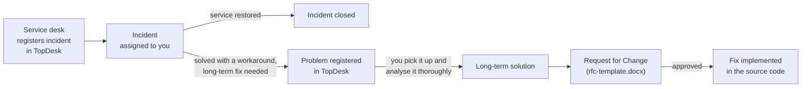

# Incident Brief

**Company:** ShopFast (fictional e-commerce platform)\
**Your role:** Service engineer in operator group *SRE – Checkout Platform*\
**Time:** 10:20 UTC, Tuesday 2026-07-07 (all times in this workshop are UTC)

## How work reaches you

At ShopFast, work follows the same flow as in our own organisation:

- An **incident** is about restoring service as fast as safely possible.
  A workaround is fine.
- A **problem** is about finding and removing the underlying cause, so the
  incident does not happen again.
- A **change** (RFC) describes, plans, and justifies the long-term solution
  so it can be reviewed and approved.

## The incident

The service desk has just assigned you a TopDesk incident:

> **I 2607 041 — Customers cannot complete checkout on webshop and app**\
> Priority: **High** · Operator group: SRE – Checkout Platform · Operator: you

Full record: `checkout-service-incident-files/topdesk-incident/I-2607-041.md`

At the same time, Grafana alerts have been posting to the Teams channel
*IT Operations > SRE Alerts*, and colleagues are posting in Teams:

> **Service desk:** "Phones are lighting up. Customers say checkout is stuck
> on 'Processing...' or shows a generic error. Some ask whether they've
> been charged twice."

> **Engineering > Payments:** "payment-gateway is seeing a wave of 429s from
> checkout-service, way more than normal traffic would explain."

## What you know at the start

- Checkout success rate has dropped from a normal ~99.5% to ~62% over the
  last 15–20 minutes.
- Customers report failed or stuck checkouts on the website and app.
- No known regional cloud provider issues (status pages are green).
- Evidence is available in `checkout-service-incident-files/`: alerts,
  Teams excerpts, logs, metrics, deploy history, the runbook, and the
  TopDesk records.

## Your task

Work through the exercises in `checkout-service-incident-exercises/exercises/`
in order, using any AI assistant you have access to:

1. **Incident intake & triage**: what is broken, how bad is it, and does
   the TopDesk classification fit?
2. **Incident resolution**: restore service (a workaround is fine),
   update and close the incident, and decide whether a problem must be
   registered.
3. **Problem analysis & change request**: pick up the problem, find the
   root cause and contributing factors, choose a long-term solution, and
   fill in `rfc-template.docx` for it.
4. **Fixing the source code**: implement the approved change in
   `checkout-service-incident-sourcecode/`, with AI assistance.

Treat this like real work: skim fast, form hypotheses, check them against
the evidence, and don't be afraid to be wrong and correct course.
