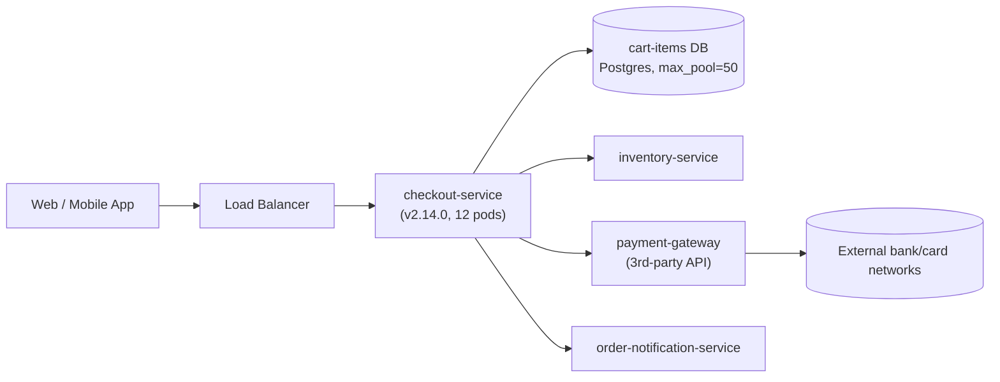

# Architecture Overview — ShopFast Checkout Path

## Components relevant to this incident

- **checkout-service** — Owns the checkout flow: validates cart, reserves
  inventory, calls payment-gateway, writes the order. Deployed via CI/CD,
  runs 12 pods behind the load balancer. Uses an ORM (Hibernate-style) to
  read cart items from Postgres.
- **cart-items DB** — Postgres database dedicated to checkout-service.
  Connection pool configured with `max_pool_size = 50` per the last
  capacity review (traffic has grown ~40% since then).
- **payment-gateway** — Third-party payment API. Has a published rate
  limit of **300 requests/minute per client**. checkout-service has a
  retry policy: 3 retries with 200ms fixed backoff on timeout or 5xx.
- **inventory-service** — Internal service, not implicated in this
  incident (included for completeness).
- **order-notification-service** — Sends confirmation emails/SMS after a
  successful order; not implicated in this incident.

## Normal operating baseline

| Metric | Normal |
|---|---|
| checkout-service p95 latency | ~120–180ms |
| checkout-service error rate (5xx) | < 0.5% |
| DB active connections (of 50 max) | 15–25 |
| payment-gateway calls/min from checkout-service | ~180/min at peak |
| payment-gateway error rate | < 0.2% |
| Checkout success rate | ~99.5% |

Keep this baseline handy when comparing against the metrics in `data/metrics/`.
